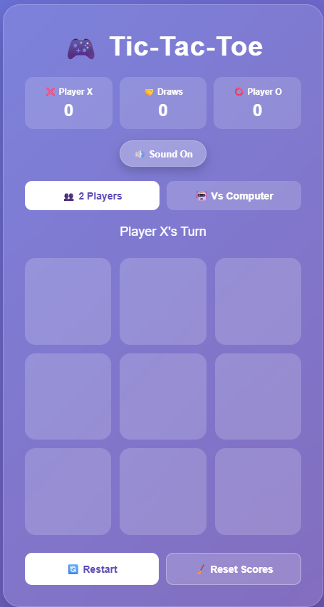

````markdown
# 🎮 PRODIGY_WD_03 — Tic-Tac-Toe Web Application

A responsive and interactive **Tic-Tac-Toe Web Application** developed as part of **Task-03** of my Web Development Internship at **Prodigy InfoTech**.

The application allows users to play Tic-Tac-Toe in **2 Player Mode** or against a **Computer AI** with a clean UI, score tracking, sound effects, animations, and winner celebration.

---

## 🚀 Live Demo

🔗 **[Play Tic-Tac-Toe](YOUR-LIVE-DEMO-LINK)**

---

## ✨ Features

- 👥 **2 Player Mode**
- 🤖 **Player vs Computer Mode**
- 🧠 **Minimax AI Algorithm**
- ❌ **X and O Turn Management**
- 🏆 **Winner Detection**
- 🤝 **Draw Detection**
- 📊 **Scoreboard**
- 🔊 **Sound Effects**
- 🔇 **Mute / Unmute**
- 🎊 **Confetti Celebration**
- 🏆 **Winner Popup**
- 🎮 **New Game Button**
- 🔄 **Restart Game**
- 🧹 **Reset Scores**
- ✨ **Smooth Animations**
- 📱 **Responsive Design**

---

## 🛠️ Technologies Used

- **HTML5**
- **CSS3**
- **JavaScript**
- **DOM Manipulation**
- **CSS Animations**
- **Minimax Algorithm**
- **Web Audio API**

---

## 🎯 Game Modes

### 👥 2 Players

Two players can play against each other.

- Player X starts the game.
- Players take turns placing X and O.
- The first player to get three marks in a row wins.
- If all nine cells are filled without a winner, the game ends in a draw.

### 🤖 Player vs Computer

Play against a computer opponent using the **Minimax algorithm**.

The computer evaluates possible moves and selects the best available move.

---

## 🧠 AI Implementation

The Computer Mode uses the **Minimax algorithm** to make intelligent decisions.

The AI can:

- Find winning moves
- Block possible winning moves
- Evaluate future game states
- Select optimal moves
- Avoid making a losing move

---

## 📊 Scoreboard

The application keeps track of:

| Score | Description |
|---|---|
| ❌ X Wins | Number of games won by Player X |
| ⭕ O Wins | Number of games won by Player O |
| 🤝 Draws | Number of games ending in a draw |

---

## 🔊 Sound Effects

Interactive sound effects are included for:

- Player moves
- Winning
- Draw
- Button clicks

Users can enable or disable sounds using the **Sound On / Sound Off** button.

---

## 🎊 Winner Celebration

When a player wins, the application displays:

- 🏆 Winner popup
- 🎊 Confetti animation
- 🔊 Winning sound
- ✨ Highlighted winning cells

---

## 📱 Responsive Design

The application is designed to work smoothly on:

- 💻 Desktop
- 💻 Laptop
- 📱 Mobile
- 📲 Tablet

---

## 📂 Project Structure

```text
PRODIGY_WD_03/
│
├── index.html
├── style.css
├── script.js
└── README.md
````

---

## ⚙️ How to Run Locally

### 1. Clone the Repository

```bash
git clone YOUR-GITHUB-REPOSITORY-LINK
```

### 2. Open the Project Folder

```bash
cd PRODIGY_WD_03
```

### 3. Run the Application

Open `index.html` in any modern web browser.

No external dependencies or installation are required.

---

## 🎮 How to Play

1. Open the Tic-Tac-Toe application.
2. Select **2 Players** or **Vs Computer**.
3. Player X starts the game.
4. Click an empty cell to place your mark.
5. Continue taking turns.
6. Get three matching marks in a row to win.
7. Use **Restart** to start a new round.
8. Use **Reset Scores** to clear the scoreboard.

---

## 📸 Project Preview

Add your project screenshot here:

```markdown

```

---

## 📚 Task Information

**Internship:** Prodigy InfoTech Web Development Internship

**Task:** Task-03

**Project:** Tic-Tac-Toe Web Application

**Task Objective:**

> Build a Tic-Tac-Toe web application where users can play against each other or against a computer opponent.

---

## 🚀 Future Improvements

* 🌐 Online Multiplayer
* 🏆 Leaderboard
* 💾 Local Storage
* 🎚️ Multiple AI Difficulty Levels
* 🌙 Dark / Light Theme
* 📱 Progressive Web App Support

---

## 👩‍💻 Author

### Kalyani Vanga

Computer Science Engineering Student interested in **Web Development, Artificial Intelligence, Machine Learning, and Data Analytics**.

🔗 **GitHub:** YOUR-GITHUB-PROFILE-LINK

🔗 **LinkedIn:** YOUR-LINKEDIN-PROFILE-LINK

---

## ⭐ Acknowledgement

This project was developed as part of the **Web Development Internship at Prodigy InfoTech**.

Thanks to **Prodigy InfoTech** for providing the opportunity to learn and build practical web development projects.

---

## ⭐ Show Your Support

If you like this project, consider giving the repository a ⭐ on GitHub.

**Thank you for checking out my project! 🎮✨**

```
```
